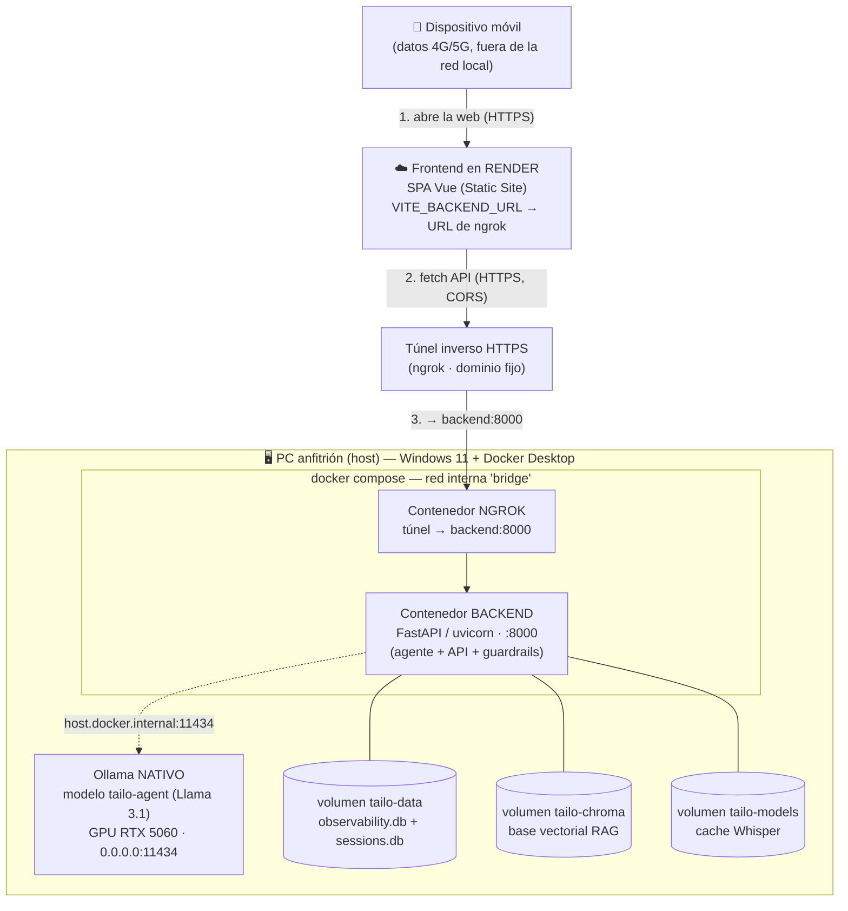

# Informe Semana 06 — Portabilidad con Docker y Exposición Pública

> **Cómo generar el PDF:** este documento está en Markdown para editarlo cómodo.
> Para el entregable, expórtalo a `entregable.semana.06.pdf` (VS Code + extensión
> *Markdown PDF*, o `pandoc INFORME-semana-06.md -o entregable.semana.06.pdf`).
> Los bloques ```mermaid``` se renderizan como diagrama en la mayoría de
> exportadores; si el tuyo no lo soporta, pega una captura del diagrama.

---

## 1. Portada

- **Proyecto:** SwingTails / Tailo — asistente de mascotas con IA local (Ollama + Llama 3.1, RAG con ChromaDB).
- **Materia:** Desarrollo Web Integral — Universidad Tecnológica Metropolitana (UTM), Cuatrimestre 9.
- **Entregable:** Semana 06 — Portabilidad con Docker y Exposición Pública (Túneles / Despliegue).
- **Integrantes:**
  1. `[Nombre integrante 1]`
  2. `[Nombre integrante 2]`
  3. `[Nombre integrante 3]`
- **Fecha:** `[fecha de entrega]`

---

## 2. Arquitectura de Red y Contenedores

La solución de la semana 05 (frontend Vue, backend FastAPI con RAG + Function
Calling + guardrails + observabilidad + voz, y ChromaDB/SQLite locales) se
empaquetó en **dos contenedores Docker** orquestados por `docker-compose.yml`.

Se adoptó la **arquitectura híbrida** que permite la rúbrica (caso Vercel/Render):
el **frontend** se publica en **Render** (nube) y el **backend** corre dockerizado
en local, expuesto a Internet por un túnel ngrok que apunta al **puerto del
backend**. El motor de inferencia **Ollama corre nativo en el host** para
aprovechar la GPU (NVIDIA RTX 5060, 8 GB VRAM) —dockerizar el passthrough de GPU
en Windows es frágil—, y el backend lo alcanza por el **puente de red de Docker**
(`host.docker.internal`). Al usar **SQLite** no hace falta un contenedor
`database`: la persistencia se resuelve con **volúmenes nombrados**. (El contenedor
`frontend`/nginx existe en el compose para pruebas locales, pero en producción el
frontend público es el de Render, por lo que es opcional.)



**Ruta de una petición desde el móvil:**

1. El móvil (en 4G/5G) abre la **web pública en Render**, que le sirve la SPA de Vue.
2. La SPA hace `fetch` a la **URL pública del backend** (la de ngrok, inyectada en
   build vía `VITE_BACKEND_URL`), enviando el header `ngrok-skip-browser-warning`.
3. El túnel ngrok (contenedor) reenvía ese tráfico HTTPS al contenedor
   **backend:8000** por la red interna de Docker.
4. El backend ejecuta el agente y, para inferir/embeddings, llama a **Ollama en el
   host** vía `host.docker.internal:11434` (Ollama escucha en `0.0.0.0` para que el
   contenedor lo alcance).
5. Cada interacción se registra en `observability.db` (volumen `tailo-data`).

**CORS:** como el frontend (dominio de Render) y la API (dominio de ngrok) están en
**orígenes distintos**, el navegador aplica la Política de Mismo Origen. El backend
lo resuelve con `CORSMiddleware` (variable `TAILO_CORS_ORIGINS`, por defecto `*`),
que habilita explícitamente las peticiones cruzadas desde el frontend en la nube.

---

## 3. Configuración de Orquestación

### 3.1 `docker-compose.yml`

Define los servicios `backend` y `frontend`, los volúmenes de persistencia y la
variable de entorno que direcciona a Ollama en el host. Un solo comando levanta
todo: `docker compose up --build`.

```yaml
services:
  backend:                         # API del agente (contenedor OBLIGATORIO)
    build: { context: ., dockerfile: Dockerfile }
    image: tailo-backend:semana06
    env_file: [ .env ]             # credenciales SwingTails (NO se hornean en la imagen)
    environment:
      OLLAMA_HOST: "http://host.docker.internal:11434"   # Ollama nativo en el host (GPU)
      TAILO_CORS_ORIGINS: "*"
      TAILO_OBSERVABILITY_DB: "/app/data/observability.db"
      TAILO_SESSIONS_DB: "/app/data/sessions.db"
      HF_HOME: "/models"
    volumes:
      - tailo-data:/app/data       # persiste observabilidad + sesiones (SQLite)
      - tailo-chroma:/app/chroma_db# base vectorial RAG ya ingestada
      - tailo-models:/models       # cache del modelo Whisper
    # En Docker Desktop 'host.docker.internal' resuelve al host de forma nativa.
    # (En Linux nativo: extra_hosts: ["host.docker.internal:host-gateway"].)
    ports: [ "8000:8000" ]         # el túnel y Postman pegan aquí
    restart: unless-stopped

  frontend:                        # nginx + build Vue (OPCIONAL en híbrido: el
    build: { context: ./frontend, dockerfile: Dockerfile }   # front público es Render)
    image: tailo-frontend:semana06
    depends_on: [ backend ]
    ports: [ "8080:80" ]
    restart: unless-stopped

  ngrok:                           # túnel inverso: expone el BACKEND a Internet
    image: ngrok/ngrok:latest
    depends_on: [ backend ]
    environment:
      NGROK_AUTHTOKEN: ${NGROK_AUTHTOKEN}          # token desde .env
    command: http --url=https://${NGROK_DOMAIN} backend:8000  # dominio fijo → API local
    restart: unless-stopped

volumes:                           # persistencia gestionada por Docker
  tailo-data:
  tailo-chroma:
  tailo-models:
```

El servicio `ngrok` levanta el **túnel inverso dentro del propio Compose**: apunta
a `backend:8000` por la red interna de Docker y publica la API en el dominio
estático `NGROK_DOMAIN`. Así, `docker compose up` levanta backend + túnel de una
sola vez (ngrok free permite un único endpoint por dominio, por lo que no debe
correrse otro agente ngrok en paralelo, o daría `ERR_NGROK_334`).

- **Puertos:** `8000→8000` expone la API (destino del túnel y de Postman); el
  `8080→80` del contenedor `frontend` es solo para pruebas locales (opcional).
- **Volúmenes:** `tailo-data` garantiza que la **bitácora de observabilidad no se
  inicialice en blanco** al reiniciar (requisito de la rúbrica). `tailo-chroma`
  conserva la base vectorial RAG ya ingestada. La primera vez, cada volumen se
  **siembra** con el contenido que la imagen trae en esas rutas.
- **Variables de entorno:** `OLLAMA_HOST` reapunta la inferencia al host; como
  `config.py` usa `load_dotenv(override=False)`, esta variable del compose
  **gana** sobre la del `.env` (que apuntaría a `localhost` dentro del contenedor).

### 3.2 `Dockerfile` (backend, multi-stage)

Compilación en dos etapas para reducir el tamaño final: la etapa *builder*
instala todas las dependencias (incluida la voz Whisper) en un virtualenv, y la
etapa *runtime* solo recibe ese virtualenv + el código + `ffmpeg`.

```dockerfile
# ETAPA 1 — builder: instala dependencias en un venv aislado
FROM python:3.11-slim AS builder          # 3.11: PyAV (voz) tiene wheel; 3.14 no
RUN python -m venv /opt/venv
ENV PATH="/opt/venv/bin:$PATH"
COPY requirements.txt requirements-voice.txt ./
RUN pip install -r requirements.txt && pip install -r requirements-voice.txt

# ETAPA 2 — runtime: imagen final ligera
FROM python:3.11-slim AS runtime
ENV PATH="/opt/venv/bin:$PATH" HF_HOME=/models
RUN apt-get update && apt-get install -y --no-install-recommends ffmpeg curl
COPY --from=builder /opt/venv /opt/venv   # solo el venv, sin toolchain de build
WORKDIR /app
COPY src/ ./src/ ; COPY corpus/ ./corpus/ ; COPY chroma_db/ ./chroma_db/ ; COPY data/ ./data/
ENV TAILO_WEB_DIST=/app/_no_web           # backend = solo API (nginx sirve la web)
HEALTHCHECK CMD curl -fsS http://localhost:8000/health || exit 1
WORKDIR /app/src
CMD ["uvicorn", "server:app", "--host", "0.0.0.0", "--port", "8000"]
```

> El archivo real (`Dockerfile`) incluye los comentarios completos de cada línea.

### 3.3 `frontend/Dockerfile` (multi-stage) y `frontend/nginx.conf`

```dockerfile
# ETAPA 1 — build de la SPA con Node
FROM node:20-alpine AS build
WORKDIR /app
COPY package.json package-lock.json ./ ; RUN npm ci
COPY . . ; RUN npm run build              # genera /app/dist

# ETAPA 2 — nginx sirve el build + reverse proxy
FROM nginx:1.27-alpine AS runtime
COPY nginx.conf /etc/nginx/conf.d/default.conf
COPY --from=build /app/dist /usr/share/nginx/html
```

Fragmento clave de `nginx.conf` — reenvía la API al backend y **desactiva el
buffer** para el streaming SSE (crítico para el TTFT):

```nginx
location ~ ^/(health|chat|conversations|transcribe|observability) {
    proxy_pass http://backend:8000;
    proxy_buffering off;          # SSE: los tokens fluyen uno a uno (no de golpe)
    proxy_read_timeout 300s;
}
location / { try_files $uri $uri/ /index.html; }   # SPA fallback
```

---

## 4. Bitácora de Conectividad Externa

> **[Sección manual — insertar capturas de pantalla]**

Evidencias a incluir:

1. **Túnel activo:** captura de la consola con la URL pública impresa por
   Cloudflare/Ngrok (`https://….trycloudflare.com` o tu dominio `.ngrok-free.dev`).
2. **Acceso desde el móvil (4G/5G):** captura del teléfono con la app cargada
   desde la URL pública, **con los datos móviles activados y el WiFi apagado**
   (para demostrar que el acceso es realmente externo).
3. **Observabilidad registrando peticiones externas:** salida de
   `docker compose exec backend python inspect_observability.py`, mostrando filas
   nuevas generadas por las peticiones del móvil (TTFT, latencia, tokens/s).

Comandos para capturar la evidencia:

```powershell
# Ver la bitácora dentro del contenedor
docker compose exec backend python inspect_observability.py

# Logs en tiempo real de los contenedores durante la interacción externa
docker compose logs -f backend frontend
```

---

## 5. Análisis Comparativo de Latencia (Local vs. Acceso Público)

Se midió el rendimiento del mismo prompt en dos escenarios: (A) accediendo en
**localhost** (sin túnel) y (B) accediendo por la **URL pública del túnel** desde
un dispositivo externo. Los datos salen de la bitácora de observabilidad
(`observability.db`), que registra TTFT y latencia total por interacción.

| Métrica                         | (A) Local (localhost) | (B) Público (túnel) | Δ (diferencia) |
|---------------------------------|-----------------------|---------------------|----------------|
| Time To First Token (TTFT)      | `[___]` ms            | `[___]` ms          | `[___]` ms     |
| Latencia total de respuesta     | `[___]` ms            | `[___]` ms          | `[___]` ms     |
| Tokens por segundo (tok/s)      | `[___]`               | `[___]`             | `[___]`        |
| Nº de mediciones (muestras)     | `[___]`               | `[___]`             | —              |

> **[Rellenar con tus mediciones reales.]** Ejecuta el mismo prompt varias veces
> en cada escenario y promedia. Para obtener los valores:
>
> ```powershell
> docker compose exec backend python inspect_observability.py
> # o vía API:  GET http://localhost:8000/observability/stats
> ```

**Análisis (cuellos de botella del túnel):** `[redactar]`. El **TTFT** aumenta en
el escenario público porque cada token debe recorrer el salto adicional
`host → servidor del túnel en la nube → móvil`; ese *round-trip* extra y la
saturación del enlace 4G/5G son el principal cuello de botella de red, mientras
que el tiempo de **inferencia** (que ocurre igual en la GPU del host en ambos
casos) permanece prácticamente constante.

---

## 6. Reflexiones Técnicas Individuales

> **[Sección manual — cada integrante redacta su reflexión.]**

- **`[Integrante 1]`:** `[Lecciones sobre contenedores y desafíos de red: qué
  aprendiste de Docker Compose, volúmenes, host.docker.internal, CORS, túneles…]`
- **`[Integrante 2]`:** `[…]`
- **`[Integrante 3]`:** `[…]`

---

## Anexo — Cómo levantar y publicar la solución

```powershell
# 0) Requisitos: Docker Desktop + Ollama nativo con el modelo 'tailo-agent'.
#    Ollama debe escuchar en TODAS las interfaces para que el contenedor lo
#    alcance (por defecto solo 127.0.0.1). Fíjalo una vez y reinicia Ollama:
setx OLLAMA_HOST "0.0.0.0:11434"
ollama list          # debe aparecer 'tailo-agent'

# 1) Poner el token/dominio de ngrok en el .env (una sola vez):
#      NGROK_AUTHTOKEN=<tu-token>
#      NGROK_DOMAIN=nomenclatorial-gilly-contessa.ngrok-free.dev

# 2) Levantar el backend + túnel con un solo comando:
docker compose up --build            # (o: docker compose up backend ngrok)

# 3) Configurar el frontend en Render (una vez):
#      Root Directory   : entregable-semana-06/frontend
#      Build Command    : npm install; npm run build
#      Publish Directory: dist
#      Env var          : VITE_BACKEND_URL = https://nomenclatorial-gilly-contessa.ngrok-free.dev

# 4) Abrir la web de Render en el móvil (datos 4G/5G). Llamará a la API por ngrok.
#    Log de peticiones del túnel:  docker compose logs -f ngrok
```
