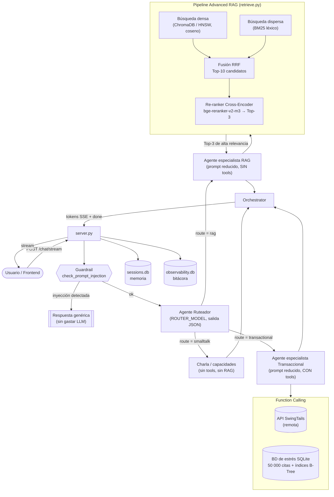

# Informe Técnico — Semana 07

**Proyecto:** SwingTails / Tailo — Asistente de IA local para tutores de mascotas
**Materia:** Desarrollo Web Integral — Cuatrimestre 9 — UTM
**Tema:** Arquitecturas Multi-Agente, Advanced RAG y Autoevaluación (LLM-as-a-Judge)

> Este documento es la fuente en Markdown del entregable técnico. El PDF final
> (`entregable.semana.07.pdf`) se arma a partir de aquí más las reflexiones
> individuales, el reporte PDF del evaluador y las capturas de evidencia.

---

## 1. Resumen de lo implementado

En la semana 05 el agente era **monolítico**: un único `System Prompt` gigante
(el del `Modelfile.tailo-agent`) con RAG + 15 herramientas serializadas en
**cada** turno. En un modelo local 8B eso degrada la precisión (prompt largo y
ambiguo). En la semana 07 se dividió esa lógica en una **arquitectura
multi-agente** coordinada por un ruteador, se optimizó el RAG con **búsqueda
híbrida + reranking**, y se automatizó la evaluación con un script
**LLM-as-a-Judge** que corre sobre una base **sembrada a escala (50 000 citas)**.

| Fase | Entregable | Archivos clave |
|------|-----------|----------------|
| A | Ruteador + subagentes especialistas | `src/agents/` (`router.py`, `rag_agent.py`, `transactional_agent.py`, `orchestrator.py`, `prompts.py`) |
| A | Sembrado de estrés 50 000 + tools locales | `src/seed_stress.py`, `src/stress_db.py`, `src/stress_tools.py` |
| B | Advanced RAG (híbrida + reranker) | `src/retrieve.py`, `src/reranker.py` |
| B | Autoevaluación LLM-as-a-Judge + PDF | `src/evaluar_agente.py` |

---

## 2. Diagrama de la arquitectura Multi-Agente y del pipeline RAG



**Flujo de tokens y de contexto entre agentes:** el `Orchestrator`
(`agents/orchestrator.py`) recibe del servidor el historial ya reconstruido
(`sessions.build_context`) y lo pasa **tal cual** al especialista elegido. El
subagente hereda el hilo completo de la conversación; solo cambia el *system
prompt* (rol) y el conjunto de herramientas. Así no hay pérdida de contexto ni
bucles: es el mismo buffer de mensajes, con un rol distinto encima.

---

## 3. Fase A — Subagentes especializados

### 3.1 Ruteador (`agents/router.py`)
Estrategia **híbrida** para minimizar latencia:

1. **Atajos deterministas** (sin LLM) para saludos/capacidades → `smalltalk`.
2. **Clasificación con el LLM** (`ROUTER_MODEL`, `temperature 0`, `format=json`,
   `num_predict` bajo): emite `{"route": "...", "reason": "..."}`.
3. **Fallback por palabras clave** si el JSON no se puede parsear (nunca se queda
   sin ruta).

Rutas: `rag` (conocimiento estático / consejo), `transactional` (operaciones y
consultas sobre la cuenta y la agenda) y `smalltalk` (charla / capacidades).

### 3.2 Especialista RAG (`agents/rag_agent.py`)
- *System prompt reducido* (`prompts.RAG_SYSTEM`): solo conocimiento y consejo,
  **sin herramientas** → no arrastra los 15 esquemas de tools.
- Acceso **exclusivo** a la base vectorial vía el pipeline de Advanced RAG.

### 3.3 Especialista Transaccional (`agents/transactional_agent.py`)
- *System prompt reducido* (`prompts.TRANSACTIONAL_SYSTEM`) con las reglas duras
  de function calling (nunca afirmar éxito sin ejecutar, arrastrar datos, no
  inventar, lista vacía = nada…).
- Herramientas **combinadas**: remotas (`tools.py`, API real) + **locales**
  (`stress_tools.py`, agenda a escala): `consultar_citas`, `contar_citas`,
  `agendar_cita_local`, `actualizar_estado_cita`.

### 3.4 Sembrado de datos de estrés (`seed_stress.py`)
Puebla `data/stress.db` (tabla `citas`) con **50 000** registros ficticios pero
coherentes usando **bulk inserts dentro de transacciones** (no un INSERT por
fila) e **índices B-Tree creados después** del sembrado.

**Evidencia real de una corrida (`--target 50000 --reset`):**

```
 SELECT COUNT(*):    50,000 citas   -> nivel Excelente (>=50k)
 Bulk insert:        50,000 filas en 0.25s (~200,385 filas/s)
 INSERT por fila:    9.716 ms/fila (commit individual) -> ~486s extrapolado a 50,000 filas
 Indice B-Tree:      consulta por fecha 8.056ms (scan) -> 0.054ms (indice)  ~148.6x mas rapido
   EXPLAIN antes:    ['SCAN citas']
   EXPLAIN despues:  ['SEARCH citas USING COVERING INDEX idx_citas_fecha (appointment_date=?)']
```

Esto demuestra empíricamente los tres conceptos de la Fase teórica D:
- **Disk sync:** bulk (0.25 s) vs INSERT-por-fila durable (~486 s extrapolados).
- **Índice B-Tree:** `O(N)` (Full Table Scan, 8 ms) → `O(log N)` (índice,
  0.054 ms), ~148× más rápido; el `EXPLAIN QUERY PLAN` pasa de `SCAN` a
  `SEARCH … USING … INDEX`.

Evidencia adicional (captura para el PDF): `SELECT COUNT(*) FROM citas;` y el
archivo `data/seed_report.txt` que genera el propio seeder.

---

## 4. Fase B — Advanced RAG

### 4.1 Búsqueda híbrida + RRF (`retrieve.py`)
- **Densa:** similitud coseno sobre embeddings `nomic-embed-text` (ChromaDB /
  HNSW) → coincidencia semántica.
- **Dispersa:** BM25 (`rank_bm25`) sobre el texto de los chunks → coincidencia
  léxica exacta (nombres, números, términos raros).
- **Fusión:** *Reciprocal Rank Fusion* — `score(d) = Σ 1/(k + rank_i(d))`. No
  necesita normalizar escalas (coseno vs BM25); usa solo las posiciones. Devuelve
  un **Top-10** candidato.

### 4.2 Re-ranking (`reranker.py`)
- **Cross-Encoder local `bge-reranker-v2-m3`** (via `sentence-transformers`, en
  CPU para no competir por la VRAM de Llama). Reevalúa el Top-10 frente a la
  pregunta y deja el **Top-3** de calidad extrema → menos tokens de ruido en el
  prompt → **menos alucinaciones y menor TTFT**.
- **Degradación con gracia:** es dependencia opcional (`requirements-rerank.txt`,
  ~2 GB). Si no está instalada, el pipeline conserva el orden de RRF y el backend
  **no se cae** (mismo patrón que Whisper en la semana 05).

Fragmento clave (config del reranker, `config.py`):

```python
HYBRID_TOP_N = 10      # candidatos tras RRF
RERANK_TOP_K = 3       # se inyectan al LLM
RRF_K = 60             # constante del paper de RRF
RERANKER_MODEL = "BAAI/bge-reranker-v2-m3"
RERANKER_DEVICE = "cpu"
```

Fragmento clave (fusión + rerank, `retrieve.py`):

```python
fused = self._rrf_fuse(dense_ids, sparse_ids, RRF_K)[:HYBRID_TOP_N]
...
rr = get_reranker().rerank(question, [c.text for c in candidates], top_k=final_k)
if rr is not None:
    ranked, t_rerank = rr           # Cross-Encoder: Top-10 -> Top-3
else:
    results = candidates[:final_k]  # degradación: orden RRF
```

### 4.3 Script de autoevaluación LLM-as-a-Judge (`evaluar_agente.py`)
- **Batería fija de 18 preguntas** (≥15 exigidas): 7 RAG, 6 transaccionales, 3 de
  inyección y 2 fuera de dominio.
- Por pregunta: la envía al agente (orquestador), registra **ruta, respuesta,
  contexto recuperado y herramientas**, y manda al **juez local** (`JUDGE_MODEL`)
  la terna *(pregunta, contexto, respuesta)* para medir **fidelidad**.
- **Métricas:** Precisión de Ruteo, Fidelidad de Respuesta (sin alucinación) y
  Bloqueo de Inyecciones; más latencia/TTFT medios y desglose por categoría.
- **Exporta un PDF** (`reporte-evaluacion-semana-07.pdf`) con `fpdf2`.

Ejecución (consola):

```powershell
cd src
python evaluar_agente.py            # requiere Ollama corriendo
python evaluar_agente.py --mock     # sin Ollama: valida pipeline + PDF
```

---

## 5. Reflexiones técnicas individuales

> *(Completar por cada integrante — la rúbrica lo pide explícitamente.)*
> Analizar, con base en el reporte del evaluador:
> - ¿Qué porcentaje de fallos tuvo el ruteador y en qué categoría?
> - ¿Cómo afectó el Reranker al **TTFT** y a la **precisión** (fidelidad)?
> - ¿Qué impacto tuvo la indexación a 50 000 registros en la latencia?

**Integrante 1 — …**

**Integrante 2 — …**

---

## 6. Cómo reproducir

Ver `COMO-CORRER.md` (sección **Semana 07**) para el paso a paso: sembrar la BD,
(opcional) instalar el reranker, levantar el backend y correr el evaluador.
